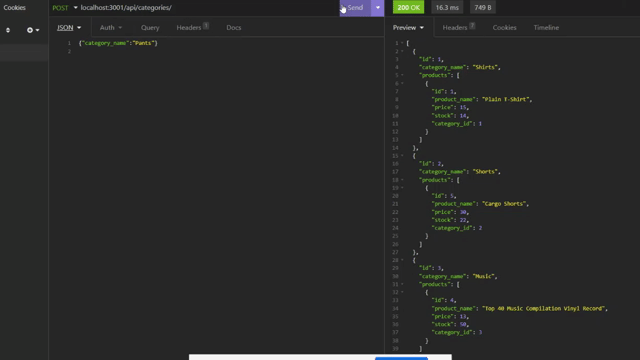
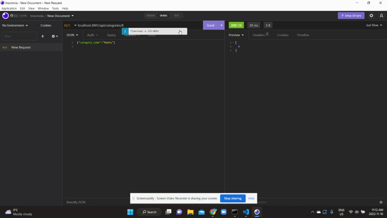
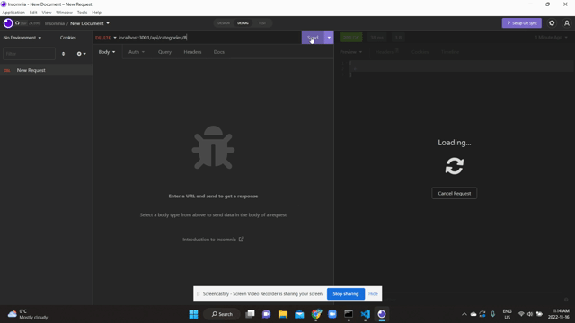

# Challenge 13 E-Commerce application

## Description

This is an e-commerce application that allows the user to connect to a database with Sequelize and seed their database with information for their products. The user is able to get all of the products, get one specific product based on its id, post within a product, put in a new product and delete a product that is no longer needed. 

## Video demonstrations

